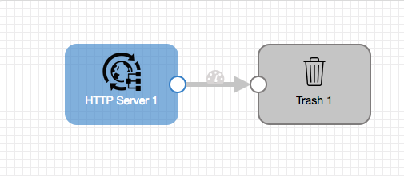

# HTTP Server to Trash

### To start pipeline on SDE start

    $ bin/edge -start=httpServerToTrash

### To pass runtime parameters

    $ bin/edge -start=httpServerToTrash -runtimeParameters='{"httpPort":"8888","sdeAppId":"sde"}'

## REST API

    $ curl -X GET http://localhost:18633/rest/v1/pipeline/httpServerToTrash/status
    $ curl -X POST http://localhost:18633/rest/v1/pipeline/httpServerToTrash/start
    $ curl -X POST http://localhost:18633/rest/v1/pipeline/httpServerToTrash/stop
    $ curl -X POST http://localhost:18633/rest/v1/pipeline/httpServerToTrash/resetOffset
    $ curl -X GET http://localhost:18633/rest/v1/pipeline/httpServerToTrash/metrics

### To pass runtime parameters during start

    $ curl -X POST http://localhost:18633/rest/v1/pipeline/httpServerToTrash/start -H 'Content-Type: application/json;charset=UTF-8' --data-binary '{"httpPort":"8888","sdeAppId":"sde"}'

## SDCe Sending Pipeline

