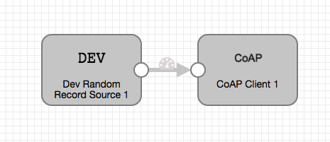

# Random to CoAP

### To start pipeline on SDE start

    $ bin/edge -start=randomToCoap

## REST API

    $ curl -X GET http://localhost:18633/rest/v1/pipeline/randomToCoap/status
    $ curl -X POST http://localhost:18633/rest/v1/pipeline/randomToCoap/start
    $ curl -X POST http://localhost:18633/rest/v1/pipeline/randomToCoap/stop
    $ curl -X POST http://localhost:18633/rest/v1/pipeline/randomToCoap/resetOffset
    $ curl -X GET http://localhost:18633/rest/v1/pipeline/randomToCoap/metrics

## SDC Edge Pipeline

## SDC Pipeline

