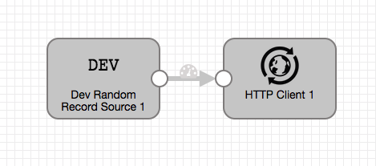

# Random to HTTP

### To start pipeline on SDE start

    <SDCE_DIST>/bin/edge -start=randomToHttp

### To pass runtime parameters

    <SDCE_DIST>/bin/edge -start=randomToHttp -runtimeParameters='{"httpUrl":"http://localhost:9999","sdcAppId":"sde"}'

## SDCe commands via REST API

### Start Pipeline
    curl -X POST http://localhost:18633/rest/v1/pipeline/randomToHttp/start

### To pass runtime parameters during start
    curl -X POST http://localhost:18633/rest/v1/pipeline/randomToHttp/start -H 'Content-Type: application/json;charset=UTF-8' --data-binary '{"httpUrl":"http://localhost:9999","sdcAppId":"sde"}'

### Check Pipeline Status
    curl -X GET http://localhost:18633/rest/v1/pipeline/randomToHttp/status

### Check Pipeline Metrics
    curl -X GET http://localhost:18633/rest/v1/pipeline/randomToHttp/metrics

### Stop Pipeline
    curl -X POST http://localhost:18633/rest/v1/pipeline/randomToHttp/stop

## SDCe Sending Pipeline

## SDC Receiving Pipeline

