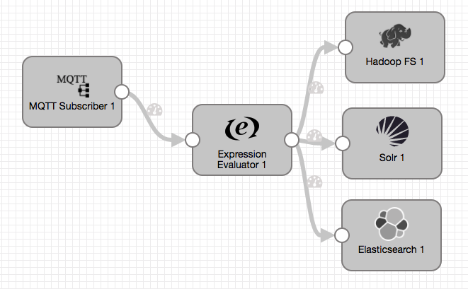

# Random to MQTT

### To start pipeline on SDE start

    <SDCe_home>/bin/edge -start=randomToMqtt

### To pass runtime parameters

    <SDCe_home>/bin/edge -start=randomToMqtt -runtimeParameters='{"mqttClientId":"sdeMqttPublisher","mqttBrokerUrl":"tcp://localhost:1883","mqttTopic":"sample"}'

## SDCe commands via REST API

### Start Pipeline
    curl -X POST http://localhost:18633/rest/v1/pipeline/randomToMqtt/start

### To pass runtime parameters during start
    curl -X POST http://localhost:18633/rest/v1/pipeline/randomToMqtt/start -H 'Content-Type: application/json;charset=UTF-8' --data-binary '{"mqttClientId":"sdeMqttPublisher","mqttBrokerUrl":"tcp://localhost:1883","mqttTopic":"sample"}'

### Check Pipeline Status
    curl -X GET http://localhost:18633/rest/v1/pipeline/randomToMqtt/status

### Check Pipeline Metrics
    curl -X GET http://localhost:18633/rest/v1/pipeline/randomToMqtt/metrics

### Stop Pipeline
    curl -X POST http://localhost:18633/rest/v1/pipeline/randomToMqtt/stop

## SDCe Sending Pipeline

## SDC Receiving Pipeline

