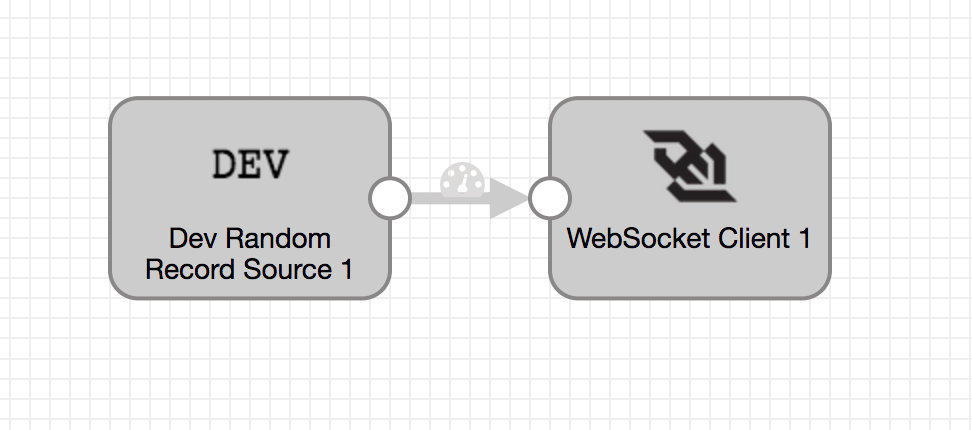
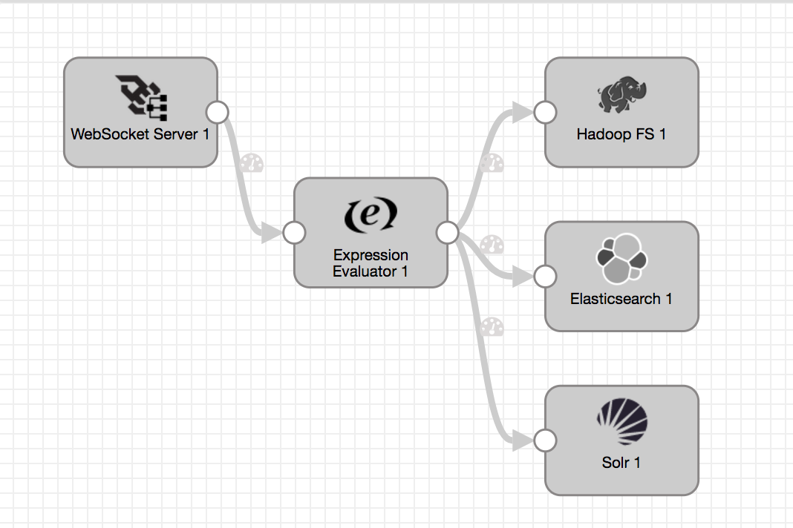

# Random to WebSocket

### To start pipeline on SDE start

    $ bin/edge -start=randomToMqtt

### To pass runtime parameters

    $ bin/edge -start=randomToWebSocket -runtimeParameters='{"webSocketUrl":"ws://localhost:8080","sdcAppId":"edge"}'

## REST API

    $ curl -X GET http://localhost:18633/rest/v1/pipeline/randomToWebSocket/status
    $ curl -X POST http://localhost:18633/rest/v1/pipeline/randomToWebSocket/start
    $ curl -X POST http://localhost:18633/rest/v1/pipeline/randomToWebSocket/stop
    $ curl -X POST http://localhost:18633/rest/v1/pipeline/randomToWebSocket/resetOffset
    $ curl -X GET http://localhost:18633/rest/v1/pipeline/randomToWebSocket/metrics

### To pass runtime parameters during start

    $ curl -X POST http://localhost:18633/rest/v1/pipeline/randomToWebSocket/start -H 'Content-Type: application/json;charset=UTF-8' --data-binary '{"webSocketUrl":"ws://localhost:8080","sdcAppId":"edge"}'

## SDC Edge Pipeline

## SDC Pipeline

