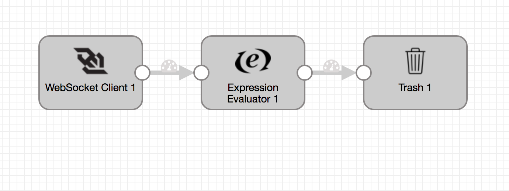

# Stream Ripple ledger information

### To start pipeline on SDE start

    <SDC Edge_home>/bin/edge -start=websocketClientToTrash -logToConsole -debug

## SDC Edge commands via REST API

### Start Pipeline
    curl -X POST http://localhost:18633/rest/v1/pipeline/websocketClientToTrash/start

### Check Pipeline Status
    curl -X GET http://localhost:18633/rest/v1/pipeline/websocketClientToTrash/status

### Check Pipeline Metrics
    curl -X GET http://localhost:18633/rest/v1/pipeline/websocketClientToTrash/metrics

### Stop Pipeline
    curl -X POST http://localhost:18633/rest/v1/pipeline/websocketClientToTrash/stop

### Reset Origin Offset
    curl -X POST http://localhost:18633/rest/v1/pipeline/websocketClientToTrash/resetOffset

## SDC Edge Sending Pipeline

