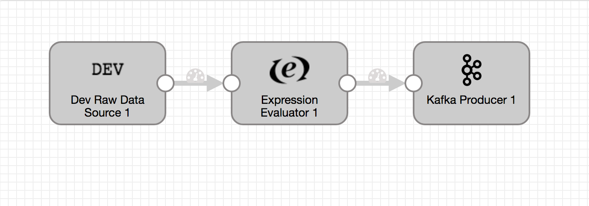
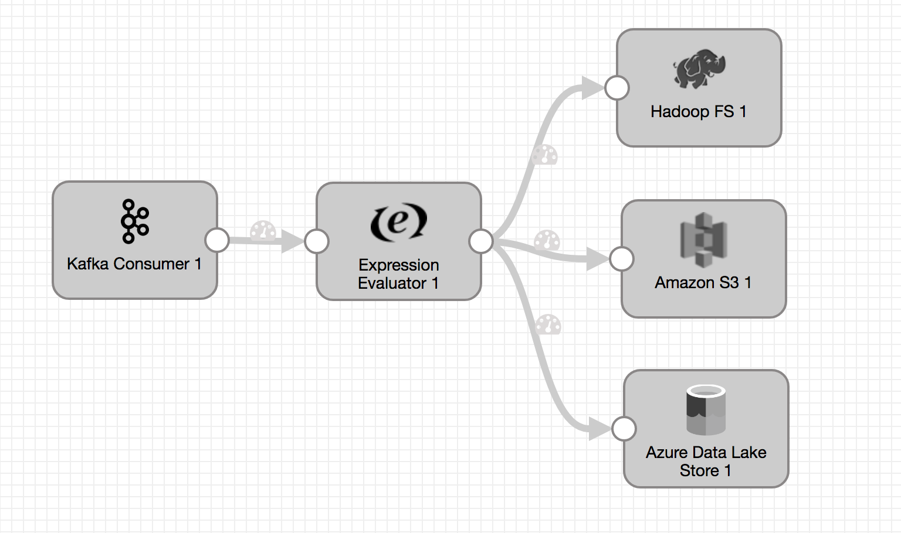

# Dev Raw Data Source To Expression Evaluator To Kafka

### To start pipeline on SDE start

    <SDC Edge_home>/bin/edge --start=devRawDataToExpressionToKafka -logToConsole

### To pass runtime parameters

    <SDC Edge_home>/bin/edge --start=devRawDataToExpressionToKafka -logToConsole -runtimeParameters='{"kafkaBrokerURI":"localhost:9092","kafkaTopicName":"sdcEdgeTopic"}'

## SDC Edge commands via REST API

### Start Pipeline
    curl -X POST http://localhost:18633/rest/v1/pipeline/devRawDataToExpressionToKafka/start

### To pass runtime parameters during start
    curl -X POST http://localhost:18633/rest/v1/pipeline/devRawDataToExpressionToKafka/start -H 'Content-Type: application/json;charset=UTF-8' --data-binary '{"kafkaBrokerURI":"localhost:9092","kafkaTopicName":"sdcEdgeTopic"}'

### Check Pipeline Status
    curl -X GET http://localhost:18633/rest/v1/pipeline/devRawDataToExpressionToKafka/status

### Check Pipeline Metrics
    curl -X GET http://localhost:18633/rest/v1/pipeline/devRawDataToExpressionToKafka/metrics

### Stop Pipeline
    curl -X POST http://localhost:18633/rest/v1/pipeline/devRawDataToExpressionToKafka/stop

### Reset Origin Offset
    curl -X POST http://localhost:18633/rest/v1/pipeline/devRawDataToExpressionToKafka/resetOffset

## SDC Edge Sending Pipeline

## SDC Receiving Pipeline

