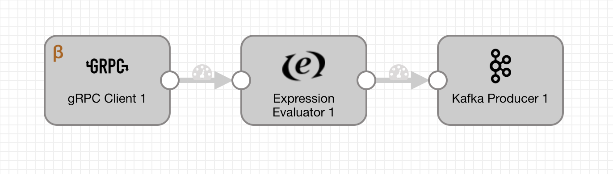
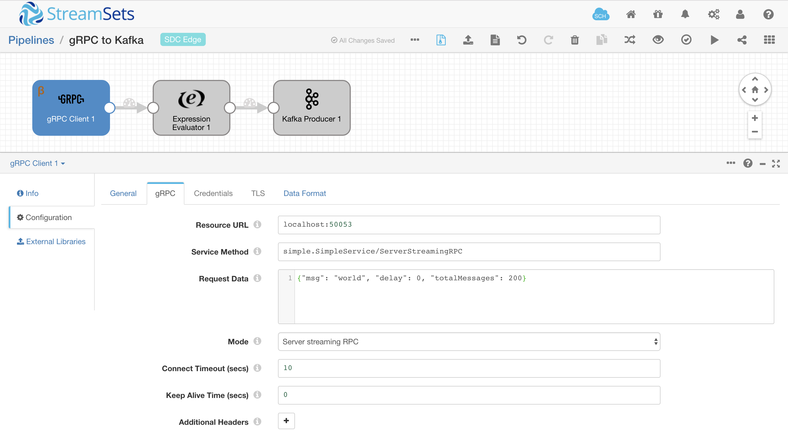

# gRPC Client To Kafka

### Start sample gRPC Server
    > git clone git@github.com:streamsets/datacollector-edge.git
    > cd datacollector-edge/stages/origins/grpc_client/testing
    > go run simple_server/main.go
      Running gRPC Simple Server on: [::]:50053
      Unary RPC Mode:
        method - simple.SimpleService/ServerStreamingRPC
        request data - {"msg": "world"}
      Server Streaming RPC Mode:
        method - simple.SimpleService/ServerStreamingRPC
        request data - {"msg": "world", "delay": 1, "totalMessages": 20000}

## SDC Edge Sending Pipeline

