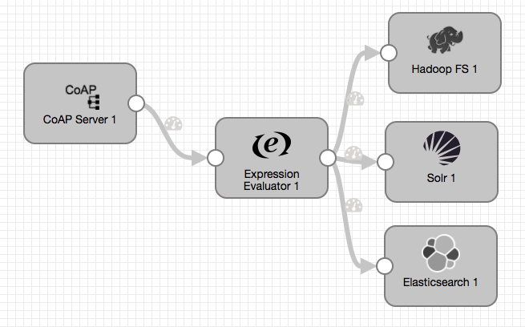

# Random to CoAP

### To start pipeline on SDE start

    <SDC Edge_home>/bin/edge -start=randomToCoap

## SDC Edge commands via REST API

### Start Pipeline
    curl -X POST http://localhost:18633/rest/v1/pipeline/randomToCoap/start

### Check Pipeline Status
    curl -X GET http://localhost:18633/rest/v1/pipeline/randomToCoap/status

### Check Pipeline Metrics
    curl -X GET http://localhost:18633/rest/v1/pipeline/randomToCoap/metrics

### Stop Pipeline
    curl -X POST http://localhost:18633/rest/v1/pipeline/randomToCoap/stop

## SDC Edge Sending Pipeline

## SDC Receiving Pipeline

