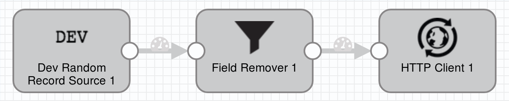

# Random to Field Filter To HTTP

### To start pipeline on SDE start

    <SDC Edge_home>/bin/edge -start=randomToFieldFilterToHttp

### To pass runtime parameters

    <SDC Edge_home>/bin/edge -start=randomToFieldFilterToHttp -runtimeParameters='{"randomFields":"a,b,c","filterOperation":"REMOVE","filterFields":["/a","/c"],"httpUrl":"http://localhost:9999","sdcAppId":"sde"}'

## SDC Edge commands via REST API

### Start Pipeline
    curl -X POST http://localhost:18633/rest/v1/pipeline/randomToFieldFilterToHttp/start

### To pass runtime parameters during start
    curl -X POST http://localhost:18633/rest/v1/pipeline/randomToFieldFilterToHttp/start -H 'Content-Type: application/json;charset=UTF-8' --data-binary '{"randomFields":"a,b,c","filterOperation":"REMOVE","filterFields":["a","b"],"httpUrl":"http://localhost:9999","sdcAppId":"sde"}'

### Check Pipeline Status
    curl -X GET http://localhost:18633/rest/v1/pipeline/randomToFieldFilterToHttp/status

### Check Pipeline Metrics
    curl -X GET http://localhost:18633/rest/v1/pipeline/randomToFieldFilterToHttp/metrics

### Stop Pipeline
    curl -X POST http://localhost:18633/rest/v1/pipeline/randomToFieldFilterToHttp/stop

## SDC Edge Sending Pipeline

## SDC Receiving Pipeline

