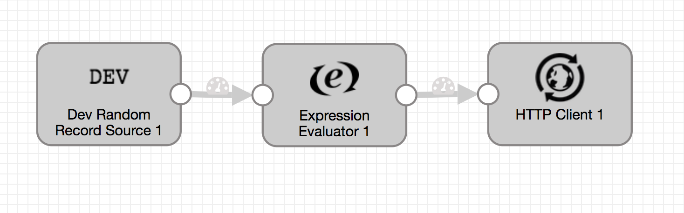

# Random Origin -> Expression Processor -> Http

### To start pipeline on SDE start

    <SDC Edge_home>/bin/edge -start=randomToExpressionToHttp

### To pass runtime parameters

    <SDC Edge_home>/bin/edge -start=randomToExpressionToHttp -runtimeParameters='{"fields":"a,b,c","batchDelay":"REMOVE", "newField":"/d", "newHeader":"/e", "newFieldFrom":"/b", "newHeaderFrom":"/c", httpUrl":"http://localhost:9999","sdcAppId":"sde"}'

## SDC Edge commands via REST API

### Start Pipeline
    curl -X POST http://localhost:18633/rest/v1/pipeline/randomToExpressionToHttp/start

### To pass runtime parameters during start
    curl -X POST http://localhost:18633/rest/v1/pipeline/randomToExpressionToHttp/start -H 'Content-Type: application/json;charset=UTF-8' --data-binary '{"fields":"a,b,c","batchDelay":"REMOVE", "newField":"/d", "newHeader":"/e", "newFieldFrom":"/b", "newHeaderFrom":"/c", httpUrl":"http://localhost:9999","sdcAppId":"sde"}'

### Check Pipeline Status
    curl -X GET http://localhost:18633/rest/v1/pipeline/randomToExpressionToHttp/status

### Check Pipeline Metrics
    curl -X GET http://localhost:18633/rest/v1/pipeline/randomToExpressionToHttp/metrics

### Stop Pipeline
    curl -X POST http://localhost:18633/rest/v1/pipeline/randomToExpressionToHttp/stop

### Expression Evaluator Parameters Description
    newField        -   New Field to create
    newHeader       -   New Header to create
    newFieldFrom    -   Field defined in this parameter is used to create the new field
    newHeaderFrom   -   Field defined in this parameter is used to create the new header

## SDC Edge Sending Pipeline

