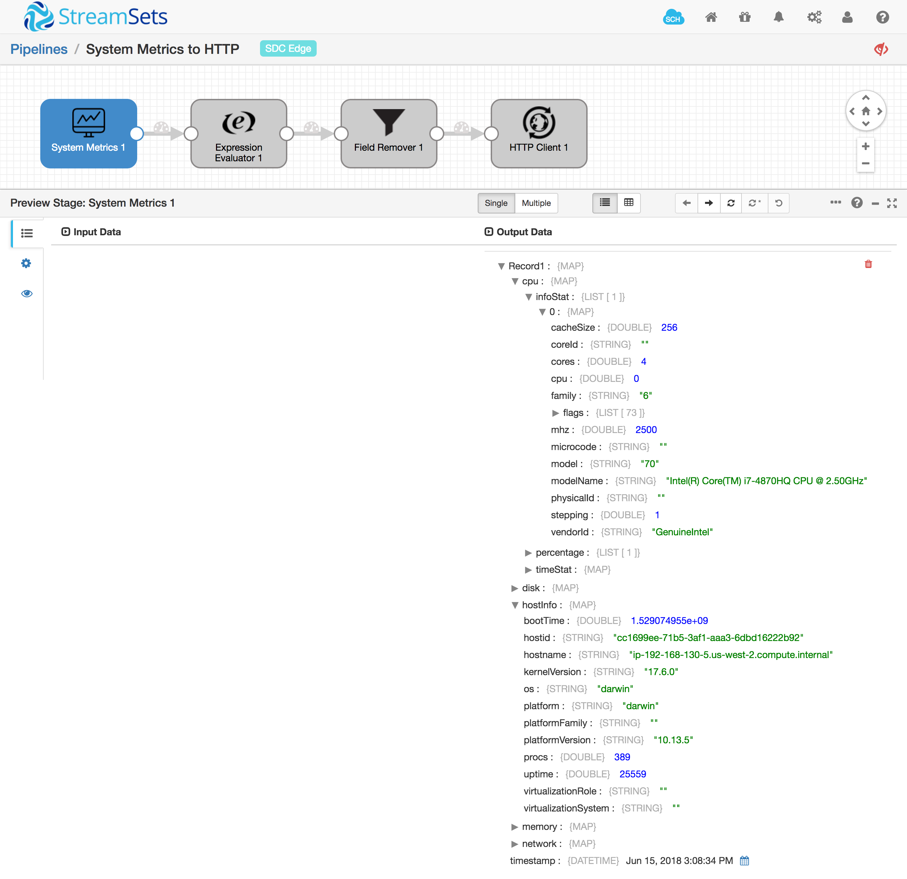

#  System level CPU usage, memory, disk IO, and network IO statistics from Linux, Windows and Mac hosts to HTTP End Point.

# Supported Architectures
    Linux i386/amd64/arm(raspberry pi)
    Windows amd64
    Darwin amd64

### To start pipeline on SDE start

    <SDC Edge_home>/bin/edge -start=serverMetricsToHttp

## SDC Edge commands via REST API

### Start Pipeline
    curl -X POST http://localhost:18633/rest/v1/pipeline/serverMetricsToHttp/start

### Check Pipeline Status
    curl -X GET http://localhost:18633/rest/v1/pipeline/serverMetricsToHttp/status

### Check Pipeline Metrics
    curl -X GET http://localhost:18633/rest/v1/pipeline/serverMetricsToHttp/metrics

### Stop Pipeline
    curl -X POST http://localhost:18633/rest/v1/pipeline/serverMetricsToHttp/stop

## SDC Edge Sending Pipeline

## Sample Preview Data

## SDC Receiving Pipeline

