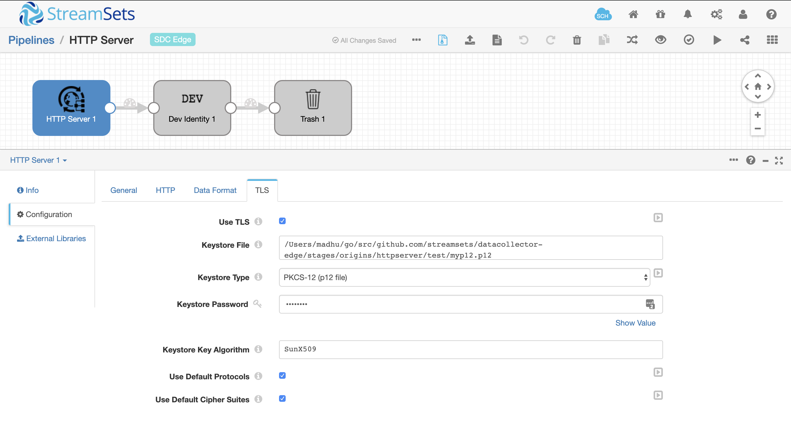

# Steps to enable HTTPS in HTTP Server Origin

## Create the key and cert
openssl req -x509 -sha256 -nodes -days 3650 -newkey rsa:4096 -keyout mykey.key -out mypem.pem

## Create pkcs12 file
openssl pkcs12 -export -out myp12.p12 -inkey mykey.key -in mypem.pem

## Configuring HTTP Server Origin

